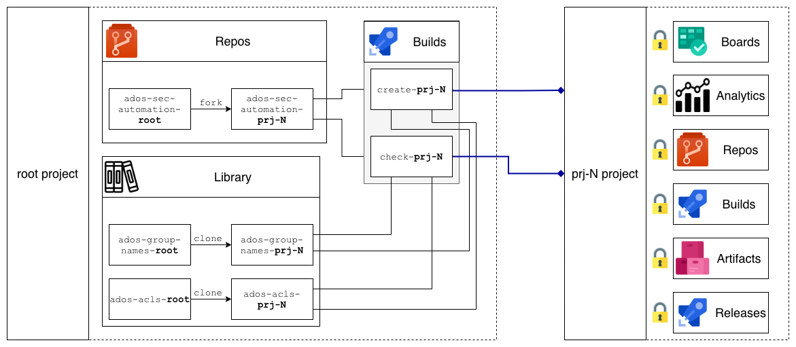

| Build status | pylint Score | License |
| ------------- | ------------- | ------------- |
|  |  |  |

# Challenge
Azure DevOps gives a nice opportunity to have dedicated projects for dedicated teams and/or projects  
However default groups and permissions are too open for enterprise projects and too hard to understand for new Azure DevOps users  
Typically it ends with the whole team using administrator permissions  

# Solution
Create common groups and set relevant permissions to keep Azure DevOps users happy  
To keep enterprise security folks happy too we can setup security monitoring to ensure that nobody violates rules  
And to keep operations happy, we can automate both projects creation and verification using Azure DevOps API and Pipelines  

# HLD diagram

# How-to use
1. Fork this repo
2. Put name of the new project to (./cloud/create-project.yml)[./cloud/create-project.yml] and (./cloud/check-project.yml)[./cloud/check-project.yml] `projectName` variable
3. Clone or create new Variable groups - `ados-group-names-$projectName` and `ados-acls-$projectName`, replace `$projectName` with the name you used in previous step
4. If you cloned Variable groups ensure that you're happy with values - **both Variable groups and values are described in detail below**
5. Put Variable group names to (./cloud/create-project.yml)[./cloud/create-project.yml] and (./cloud/check-project.yml)[./cloud/check-project.yml]
6. Create new Azure DevOps pipeline using (./cloud/create-project.yml)[./cloud/create-project.yml], rename it, run and check logs
7. Create new Azure DevOps pipeline using (./cloud/check-project.yml)[./cloud/check-project.yml], rename it, run and check logs

# Azure DevOps APIs
## Azure DevOps UI vs API
In Azure DevOps UI naming is a bit different from API naming, e.g. in Artifact feed UI role is called "Owner" and API name is "administrator": [screenshot](https://prnt.sc/rq78ye)

## Azure DevOps APIs and Versions
Yes, you read it right - Azure DevOps has a few APIs, e.g.:  
regular `https://dev.azure.com/{}/_apis/projects?api-version=5.0` to create Project,  
new `https://vssps.dev.azure.com/{}/_apis/graph/groups?scopeDescriptor={}&api-version=5.0-preview.1` to create Group  
and dedicated `https://feeds.dev.azure.com/{}/{}/_apis/packaging/feeds?api-version=5.0-preview.1` to create Artifact feed  
Here's summary of scripts vs used APIs (actions should be understandable from script names):  
`https://dev.azure.com` version `5.0` (can be switched to `5.1` if necessary):
1. [./cloud/create_project](./common/create_project.py)
2. [./cloud/export_project](./cloud/export_project.py)
3. [./cloud/get_ace](./common/get_permissions.py)
4. [./cloud/set_ace](./common/set_permissions.py)

`https://vssps.dev.azure.com` version `5.0-preview.1` vs TFSSecurity CLI:
1. [./cloud/create_group](./cloud/create_group.py)
2. [./cloud/get_group](./cloud/get_group.py)
3. [./cloud/delete_group](./cloud/delete_group.py)
4. [./cloud/get_group_members](./cloud/get_group_members.py)
5. [./cloud/export_group_info](./cloud/export_group_info.py)
6. [./cloud/export_project_info](./cloud/export_project_info.py)  
This API in not available in Azure DevOps Server v2019.Update1.1 so [TFSSecurity](https://docs.microsoft.com/en-us/azure/devops/server/command-line/tfssecurity-cmd?view=azure-devops-2019&viewFallbackFrom=azure-devops) CLI must be used  
TFSSecurity CLI can be executed on server where Azure DevOps is installed, so you have to install agent on that (obviously Windows-based) machine  
This is annoying because Python tasks on self-managed Windows agents are problematic, so I had to install Python manually and wrapped Python calls into PowerShell in tasks  
For Azure DevOps in the Cloud Python calls were wrapped with Bash to add `sleep 1` (see details bellow in "Azure DevOps API throttling" section) but Windows Server doesn't have Bash by default and I decided not to install it and use PowerShell  
Another important thing is account used to run Azure DevOps agent - it must have admin permissions to use TFSSecurity and by default it's just a network service. So be control who can use that agent with high privileges in Azure DevOps  
The last but not least complain about TFSSecurity is it's output - [poorly formatted console output](https://prnt.sc/ruxi6y ). No YAML. No CSV. No JSON. So I had to develop a few workarounds to manage it, e.g. [./onprem/export_group_info.py](./onprem/export_group_info.py) Hope separate boiler in hell is waiting for TFSSecurity CLI developers :pray:  

`https://feeds.dev.azure.com` version `5.0-preview.1` (can be switched to `5.1-preview.1` if necessary):
1. [./cloud/create_feed](./cloud/create_feed.py)
2. [./cloud/export_feed_info](./cloud/export_feed_info.py)
3. [./cloud/set_feed_acl](./cloud/set_feed_acl.py)
4. [./cloud/get_feed_acl](./cloud/get_feed_acl.py)  
This API in not available in Azure DevOps Server v2019.Update1.1 so [regular one](https://docs.microsoft.com/en-us/rest/api/azure/devops/artifacts/feed%20%20management/create%20feed?view=azure-devops-server-rest-5.0) must be used  
It has an important limitation - feeds can not be created in project scope, only on collection level  

`https://vsrm.dev.azure.com` version `5.0` (can be switched to `5.1` if necessary):
1. [./cloud/create_tmp_release_pipeline](./common/create_tmp_release_pipeline.py)
2. [./cloud/delete_tmp_release_pipeline](./common/delete_tmp_release_pipeline.py)

Azure DevOps Server (on-premise) doesn't support certain APIs, e.g. `https://vssps.dev.azure.com` version `5.0-preview.1` must be replaces with [TFSSecurity](https://docs.microsoft.com/en-us/azure/devops/server/command-line/tfssecurity-cmd?view=azure-devops-2019)  
Version `5.0-preview.1` can't be used as indicator because Azure DevOps Server uses Version `5.0-preview.3` for [some actions](https://docs.microsoft.com/en-us/azure/devops/organizations/projects/restore-project?view=azure-devops-2019)  

## Personal vs System access token
Default permissions of System access token are not enough to perform all CRUD actions  
Those permissions can be extended, but it's too dangerous because other pipelines will use them  
So solution is to create another "root" user and use it's Personal Access Token  

## Azure DevOps API throttling
On the one hand I never had `429` from Azure DevOps API but on the other hand I had number of situations when after received `200` change wasn't present  
So I added those ugly `sleep 1` actions to all pipeline's tasks and a few tasks with `sleep 10` to wait until certain resources are created  

## Response codes
Azure DevOps API can respond with `2**` codes - some of them stand for real success (e.g. resource created) but some mean that call was answered  
To address this situation some scripts use not only `Exception` for `requests` but also check `status_code` of the response to match desired e.g. `204` in `delete_group`

## Organization
All scripts have `--organization` parameter but pipelines don't insert it because default value is name of my Azure DevOps organization - `kagarlickij`  
Don't forget to change it in your fork  

## Project ID vs Project scope descriptor
APIs (e.g. `https://vssps.dev.azure.com`) use [scopeDescriptor](scopeDescriptor)
..and some APIs use (`https://dev.azure.com`) tokens (described above) that consist of [projectId](https://docs.microsoft.com/en-us/rest/api/azure/devops/core/projects/get%20project%20properties?view=azure-devops-rest-5.1#uri-parameters) and separator characters  
For pipeline's tasks usage `scopeDescriptor` is exported as `PROJECT_SCOPE_DESCRIPTOR` and `projectId` is exported as `PROJECT_ID` by [./cloud/export_project_info.py](./cloud/export_project_info.py) script  

# Azure DevOps Security basics
## Security namespaces
As per [documentation](https://docs.microsoft.com/en-us/rest/api/azure/devops/security/security%20namespaces?view=azure-devops-rest-5.1) security namespaces are used to store access control lists (ACLs) on tokens  
You can get list of namespaces with `GET 'https://dev.azure.com/{organization}/_apis/securitynamespaces?api-version=5.1'`  
As for now, there're 60 namespaces, for our purposes we'll use a few of them:
`52d39943-cb85-4d7f-8fa8-c6baac873819` for Project  
`d34d3680-dfe5-4cc6-a949-7d9c68f73cba` for AnalyticsViews  
`2e9eb7ed-3c0a-47d4-87c1-0ffdd275fd87` for Git Repositories  
`33344d9c-fc72-4d6f-aba5-fa317101a7e9` for Builds  
`c788c23e-1b46-4162-8f5e-d7585343b5de` for ReleaseManagement  

## Tokens
As per [documentation](https://docs.microsoft.com/en-us/azure/devops/cli/security_tokens?view=azure-devops) Tokens are arbitrary strings representing resources in Azure DevOps.  
Token format differs per resource type, however hierarchy and separator characters are common between all tokens  
To get Token for security namespace run `GET https://dev.azure.com/{organization}/_apis/accesscontrollists/{securityNamespaceId}?api-version=5.1`  
For Project namespace token format is `$PROJECT:vstfs:///Classification/TeamProject/{projectId}`  
For Git Repositories namespace token format is `repoV2/{projectId}`  
For AnalyticsViews namespace token format is `$/Shared/{projectId}`  
For Build and ReleaseManagement it's just `{projectId}`  
Those reflected in [./cloud/get_ace](./common/get_permissions.py) and [./cloud/set_ace](./common/set_permissions.py) conditions  

## Numbers for permissions
Permissions for majority of resources are present as sum of "bits" (numbers) for actions in namespace  
e.g. in AnalyticsViews user (or group) that has to have "Read" (`1` as a "bit" value) and "Execute" (`8` as a "bit" value) permissions, "allow" field in ACL's "acesDictionary" must have `9` as value  
The same logic is fair for "deny" rules, and resulting ACL looks like [this](https://prnt.sc/rqat79)  
Artifact feed permissions are different, there are no "acesDictionary" and "bits", more simple concept of "roles" is used instead: [screenshot](https://prnt.sc/rqaz0p)

## Create entity and set permissions
As mentioned above permissions are set in resource's ACL and existing entities (user or group) must be used  
So there's no way to create user and group and set permissions at the same time  
In ACL [descriptors](https://docs.microsoft.com/en-us/rest/api/azure/devops/graph/?view=azure-devops-rest-5.1#descriptors) are used instead of group (user) names to provide cross-account capabilities  

# Azure DevOps Artifact feeds
## Artifact feed name is still "busy" after feed is deleted
Current solution creates dedicated project-scoped feed for each project  
It might be a situation when project has to be deleted and then created again  
But feed with the same name will fail to create even if it was deleted from "Deleted feeds" (trashbox for feeds)  
e.g. when I'm trying to create `test1` feed I'm getting response ["A feed named 'test1' already exists."](https://prnt.sc/rqp4qy) but when I'm listing feeds `test1` does not exist in both [API](https://prnt.sc/rqp5na) and [UI](https://prnt.sc/rqp6fo) including ["Deleted feeds"](https://prnt.sc/rqp62s)  

# `create-project` pipeline
`create-project` pipeline creates new project based on "security template" and consist of the following steps:
1. Create project  
`--processTemplate` param set to be Scrum ('6b724908-ef14-45cf-84f8-768b5384da45') by default  
Process templates ids can be listed with [Processes - List API](https://docs.microsoft.com/en-us/rest/api/azure/devops/processes/processes/list?view=azure-devops-rest-5.1)  
`--projectDescription` param is optional and empty by default  
`sourceControlType` is hardcoded to be Git  
`visibility` is hardcoded to be Private  

2. Export project-related info  
As mentioned above `PROJECT_ID` and `PROJECT_SCOPE_DESCRIPTOR` vars are exported for further usage  

3. Create tmp Release pipeline  
Unlike builds, you have to have at least one Release pipeline to be able set permissions in ReleaseManagement namespaces  
Built-in 'Release Administrators' group is also created automatically by Azure DevOps after first release pipeline is created  
So we have to create dummy release pipeline and delete it later  

4. Delete built-in groups  
Since we will use our custom groups default (built-in) groups can be deleted  
However 'Project Valid Users', 'Project Administrators' and '$projectName Team' groups can't be deleted  
I prefer to delete default groups because '$projectName Team' inherits some undesired permissions from other default groups  
If people are added to default 'Project Administrators' group `check-project` pipeline will alert since it is not desired  

5. Create custom groups  
`Administrators` - ADOS setup, Releases setup (until we have it as code), security changes (both ADOS and app related)  
`Developers` - develop apps, develop build pipelines, watching Builds and Releases  
`Product Owners` - manage Release activities  
`Auditors` - checking security configs (current vs desired)  
Each group has prefix with project name (e.g. `prj01-developers`) to make cross-project access easy if it's required  
`https://vssps.dev.azure.com` API must be used, so dedicated [create_group.py](create_group.py) script was created  

6. Export group info  
Exports group ACE as a var for further usage  
Format of ACE from time to time causes incorrect padding in Python so [fix](https://stackoverflow.com/questions/2941995/python-ignore-incorrect-padding-error-when-base64-decoding) is applied  

7. Set Project permissions for each group  
Here's the first time when [./common/set_permissions.py](./common/set_permissions.py) script comes into the game  
It will be used to set almost all permissions so threat it with extra care  

8. Set Analytics permissions for each group  
Analytics views are located in the same UI section Project permissions but have different security namespace and token format  

9. Set Git permissions for each group  
This security namespace also has different token format and [./common/set_permissions.py](./common/set_permissions.py) knows about that  

10. Set Build permissions for each group  
Nothing too special here, token in this security namespace is equal to project id

11. Set Release permissions for each group  
This task will fail if tmp Release pipeline was not created (Step #3)  

12. Create Artifact feed  
Feed is created for specific project only, it has default capabilities and upstream disabled - all is hardcoded in [./cloud/create_feed.py](./cloud/create_feed.py)  
`https://feeds.dev.azure.com` API must be used, so dedicated [./cloud/create_feed.py](./cloud/create_feed.py) script was created  

13. Export feed info  
`FEED_ID` var is exported for further usage  

14. Set feed permissions
As described above, feeds use roles instead of permissions "bits" and `https://feeds.dev.azure.com` instead of `https://dev.azure.com/`  
So dedicated [./cloud/set_feed_acl.py](./cloud/set_feed_acl.py) script is used instead of [./common/set_permissions.py](./common/set_permissions.py)  

# `check-project` pipeline
1. Export project-related info  
As mentioned above `PROJECT_ID` and `PROJECT_SCOPE_DESCRIPTOR` vars are exported for further usage  

2. Check list of groups  
Checks if no additional groups were created and/or existing groups deleted/renamed  

3. Check group members  
Checks only default groups that can't be deleted: 'Project Valid Users' and 'Project Administrators'  
Nobody should be added to those groups, so desired quantity of members is 0  
However creator of the project (user, whose PAT was used in pipeline) is set to be member of 'Project Administrators'

4. Export group info  
Exports group ACE as a var for further usage  
Format of ACE from time to time causes incorrect padding in Python so [fix](https://stackoverflow.com/questions/2941995/python-ignore-incorrect-padding-error-when-base64-decoding) is applied  

5. Check Project permissions for each group  
[./common/get_permissions.py](./common/get_permissions.py) script will check if current permissions match desired  
As well as [./common/set_permissions.py](./common/set_permissions.py) [./common/get_permissions.py](./common/get_permissions.py) knows about different tokens for different security namespaces  

6. Check Analytics permissions for each group  
[./common/get_permissions.py](./common/get_permissions.py) script will check if current permissions match desired  

7. Check Git permissions for each group  
[./common/get_permissions.py](./common/get_permissions.py) script will check if current permissions match desired  

8. Check Git repos settings [task](./cloud/check_git_repos.py) performs the following checks on all repos in the project:  
Check if all branches follow naming standards: allowed names are `master`, `feature/` and `bugfix/`  
Check if all branches are up to date: latest commit shouldn't be older than X days (see `ados-git-params-$projectName` below for details), however `master` branch is excluded from this check  
Check if all Pull requests are up to date: pull requests shouldn't be older than X days (see `ados-git-params-$projectName` below for details)  
All 3 checks generate warnings, not errors  
The latest one checks if `master` branch has at least one policy assigned, and if now, error will be raised  
Some repos can be excluded from checking by putting name to [excluded_repos.txt](excluded_repos.txt) file  

9. Check Build permissions for each group  
[./common/get_permissions.py](./common/get_permissions.py) script will check if current permissions match desired  

10. Check Release permissions for each group  
[./common/get_permissions.py](./common/get_permissions.py) script will check if current permissions match desired  

11. Export feed info  
`FEED_ID` var is exported for further usage  

11. Check Artifact feed permissions for each group  
[./cloud/get_feed_acl.py](./cloud/get_feed_acl.py) script is used instead of [./common/get_permissions.py](./common/get_permissions.py) because of `https://feeds.dev.azure.com` API is used  

# Pipelines execution
## Triggers
`create-project` pipeline is executed once, so no triggers needed  
`check-project` pipeline must be executed on schedule, default is 2AM  
Execution time is about 1 minute, so schedule can be set to be hourly  
However there's still a risk that person will be added to 'Project Administrators' group, perform some "bad" actions, removed from the group and `check-project` pipeline will not catch it because all actions are less than 1h long  
This is an advanced scenario and to address it real-time log analytics must be set to watch Azure DevOps logs  

## Variables
Both `create-project` and `check-project` pipelines must used the same variables in variable groups  
Moreover, it's recommended not to change variables after `create-project` execution otherwise "current desired state" will not match "initial desired state"  
Azure DevOps variable groups don't have history of changes and versioning so it's recommended to use [linking with Azure Key Vault](https://docs.microsoft.com/en-us/azure/devops/pipelines/library/variable-groups?view=azure-devops&tabs=yaml#link-secrets-from-an-azure-key-vault)  
This is the reason why permissions for Variable groups are not set by `create-project` pipeline - all variables are managed by Azure Key Vault  
`projectName` is the only variable hardcoded in pipelines, change it's value right after forking this repo  

`ados-group-names-$projectName` group contains names of custom groups to create and names of ACEs to use as environment variable names, example:  
| Name | Value |
| ------------- | ------------- |
| administrators-group-sid | $(administrators-group-name)-ace |
| administrators-group-name | $(projectName)-administrators |
| auditors-group-sid | $(auditors-group-name)-ace |
| auditors-group-name | $(projectName)-auditors |
| developers-group-sid | $(developers-group-name)-ace |
| developers-group-name | $(projectName)-developers |
| product-owners-group-sid | $(product-owners-group-name)-ace |
| product-owners-group-name | $(projectName)-product-owners |

If you want to add more groups or remove some of existing don't forget to change both variable group and pipeline's tasks

`ados-acls-$projectName` group contains "security bits" for each group per each security namespace, example:
| Name | Value |
| ------------- | ------------- |
| administrators-analytics-allow-permissions | 6 |
| administrators-analytics-deny-permissions | 0 |
| administrators-build-allow-permissions | 65535 |
| administrators-build-deny-permissions | 0 |
| administrators-feed-permissions | administrator |
| administrators-git-allow-permissions | 65534 |
| administrators-git-deny-permissions | 0 |
| administrators-project-allow-permissions | 11729915 |
| administrators-project-deny-permissions | 4259844 |
| administrators-release-allow-permissions | 65535 |
| administrators-release-deny-permissions | 0 |
| auditors-analytics-allow-permissions | 0 |
| auditors-analytics-deny-permissions | 6 |
| auditors-build-allow-permissions | 1025 |
| auditors-build-deny-permissions | 31742 |
| auditors-feed-permissions | reader |
| auditors-git-allow-permissions | 2 |
| auditors-git-deny-permissions | 65532 |
| auditors-project-allow-permissions | 2097665 |
| auditors-project-deny-permissions | 13892094 |
| auditors-release-allow-permissions | 33 |
| auditors-release-deny-permissions | 4062 |
| developers-analytics-allow-permissions | 0 |
| developers-analytics-deny-permissions | 6 |
| developers-build-allow-permissions | 1921 |
| developers-build-deny-permissions | 30846 |
| developers-feed-permissions | collaborator |
| developers-git-allow-permissions | 16758 |
| developers-git-deny-permissions | 48776 |
| developers-project-allow-permissions | 2104105 |
| developers-project-deny-permissions | 13885638 |
| developers-release-allow-permissions | 97 |
| developers-release-deny-permissions | 3998 |
| product-owners-analytics-allow-permissions | 6 |
| product-owners-analytics-deny-permissions | 0 |
| product-owners-build-allow-permissions | 1025 |
| product-owners-build-deny-permissions | 31742 |
| product-owners-feed-permissions | reader |
| product-owners-git-allow-permissions | 16486 |
| product-owners-git-deny-permissions | 49048 |
| product-owners-project-allow-permissions | 11723265 |
| product-owners-project-deny-permissions | 4266494 |
| product-owners-release-allow-permissions | 2169 |
| product-owners-release-deny-permissions | 1926 |

`ados-git-params-$projectName` group contains parameters for git checks, example:
| Name | Value |
| ------------- | ------------- |
| maxCommitAge | 15 |
| maxPullRequestAge | 5 |
| minApproverCount | 1 |

`ados-secrets` group contains Personal Access Token that is used for all API actions, described in details above in "Personal vs System access token" section
| Name | Value |
| ------------- | ------------- |
| pat | ***** |
`*****` - because marked as secret

## Azure DevOps specific syntax in scripts
All Python scripts can be executed on any machine with Python 3 runtime, e.g. `python ./common/create_project.py --projectName 'test1' --pat 'a***q'`  
However some Azure DevOps specific syntax is present in scripts:  
1. All `print` functions have `[INFO]` or `[ERROR]` prefixes to make output more readable and properly [colored in Azure DevOps logs](https://developercommunity.visualstudio.com/content/problem/440605/write-host-foreground-color-with-powershell-task-i.html), [example](https://prnt.sc/rqzu2x)  
However it is not supported in Azure DevOps Server v2019.Update1.1  
2. Environment variables are set via [`task.setvariable` logging command](https://docs.microsoft.com/en-us/azure/devops/pipelines/process/variables?view=azure-devops&tabs=yaml%2Cbatch#set-variables-in-scripts)  
